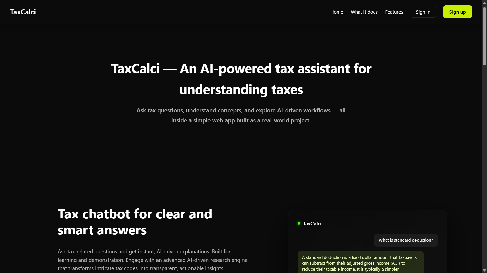
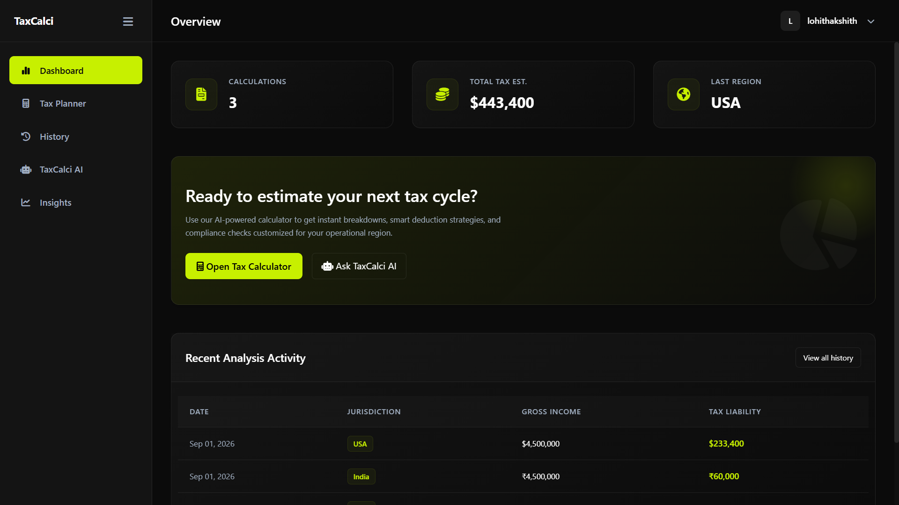
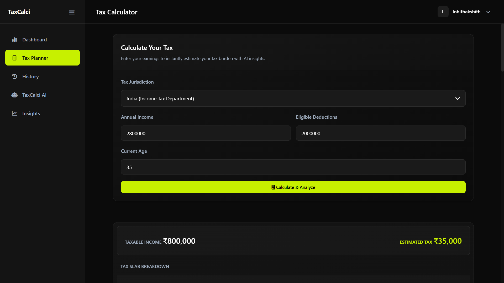
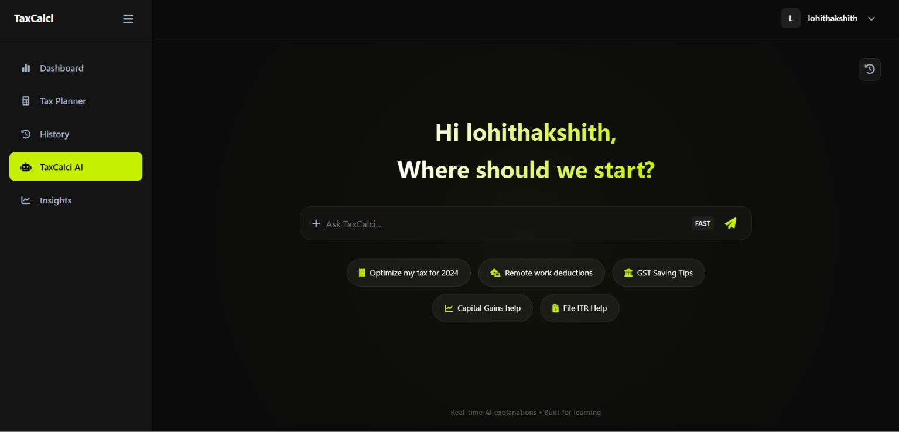

# TaxCalci

TaxCalci is a full-stack web application that combines a rule-based tax calculation engine with an AI-powered advisory system. It allows users to calculate estimated tax liability and receive AI-generated explanations and personalized tax-saving suggestions.

## Demo

### Live Demo: https://taxcalci-ai.onrender.com/

## Screenshots

## Features

- User authentication (signup, login, logout)
- Multi-country tax calculation with structured tax logic
- AI-powered tax explanations and tax-saving suggestions
- Persistent tax calculation history
- AI advisor with conversation history
- SaaS-style dashboard with user summaries
- Protected user data and authenticated workflows
- Responsive interface built with HTML, CSS, JavaScript, and Django Templates
- Modular backend architecture using multiple Django apps
- Automated tests covering core tax logic and calculation workflows

## Project Structure

    backend/
    ├── accounts/       # Authentication and user management
    ├── tax_engine/     # Tax calculation logic and calculation APIs
    ├── ai_advisor/     # AI integration and conversational advisor
    ├── dashboard/      # Dashboard and calculation history
    └── config/         # Main Django project configuration

    templates/
    ├── accounts/       # Authentication pages
    ├── tax_engine/     # Tax calculator and result pages
    └── ai_advisor/     # AI advisor interface

## How It Works

1. The user enters income and deduction details.
2. The `tax_engine` processes the input using predefined tax rules.
3. The calculated result is stored for the authenticated user.
4. The result is passed to the AI advisory service.
5. The AI generates explanations and personalized suggestions.
6. Users can view previous calculations and conversations through the dashboard.

## Tech Stack

- **Backend:** Python, Django
- **Frontend:** HTML, CSS, JavaScript, Django Templates
- **Database:** PostgreSQL (production), SQLite (local development)
- **AI Integration:** Groq API
- **Testing:** Django Test Framework
- **Deployment:** Render
- **Version Control:** Git, GitHub

## Setup Instructions

### 1. Clone the repository

    git clone https://github.com/Lohithakshith2007/TaxCalci.git
    cd TaxCalci\backend

### 2. Create and activate a virtual environment

    python -m venv env

Windows:

    env\Scripts\activate

### 3. Install dependencies

    pip install -r requirements.txt

### 4. Configure environment variables

Create a `.env` file and provide the required environment variables:

    SECRET_KEY=your_django_secret_key
    GROQ_API_KEY=your_groq_api_key

For production deployments, configure these variables through the hosting platform's environment variable settings rather than committing them to the repository.

### 5. Apply database migrations

    python manage.py migrate

### 6. Run the development server

    python manage.py runserver

The application will be available at:

    http://127.0.0.1:8000/

## Testing

The project includes automated Django tests covering:

- Tax calculation logic across supported jurisdictions
- Case-insensitive country handling
- Zero-income scenarios
- Unsupported country handling
- Calculation API workflows
- Authenticated and unauthenticated requests
- Calculation persistence
- AI service integration using mocked API calls
- Invalid JSON input
- Model behavior

Run the test suite with:

    python manage.py test tax_engine

The current test suite contains 14 automated tests.

### Test Coverage

The core tax calculation service has 100% test coverage.

To reproduce the coverage report locally:

    coverage run manage.py test tax_engine
    coverage report

## Deployment

The application is deployed using Render.

The Django project and `Procfile` are located inside the `backend` directory. Production environment variables such as `SECRET_KEY` and `GROQ_API_KEY` must be configured through the deployment platform.

## Future Improvements

- Expand and refine tax rules for additional jurisdictions
- Add more detailed tax reports and analytics
- Improve AI advisor context and personalization
- Add additional automated test coverage for dashboard and account workflows
- Introduce production-grade monitoring and error tracking

## License

This project is for educational and demonstration purposes.
